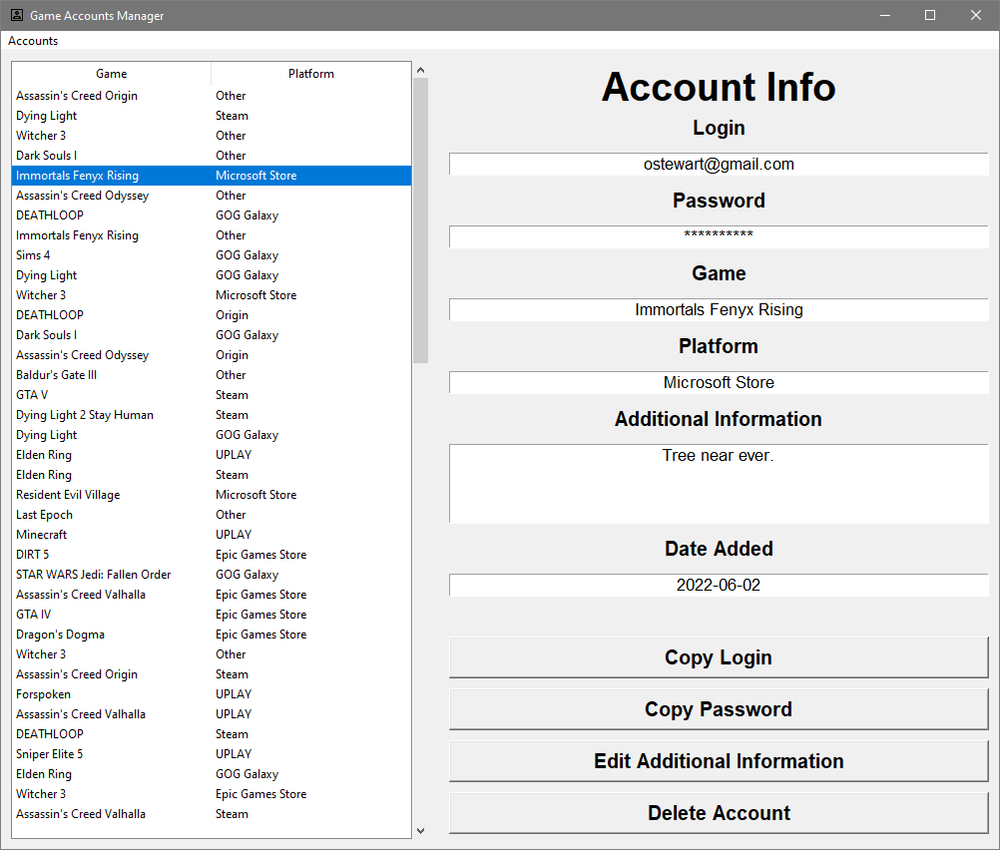
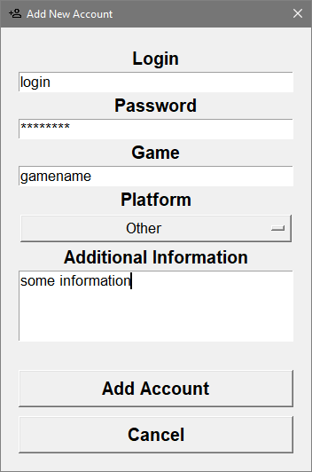
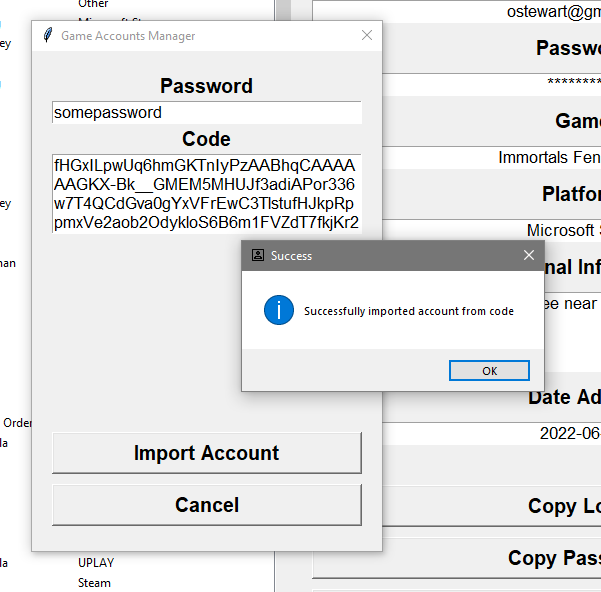

# Game Accounts Manager
A simple application allowing user to store credentials to different accounts with games.

## Requirements
```
pip install -r requirements.py
```

## Running the app
```
py main.py
```
Database and encryption key will be generated on application start if not present.

You can run `setup/generate_fake_data.py` to generate some random accounts.

## Screenshots




